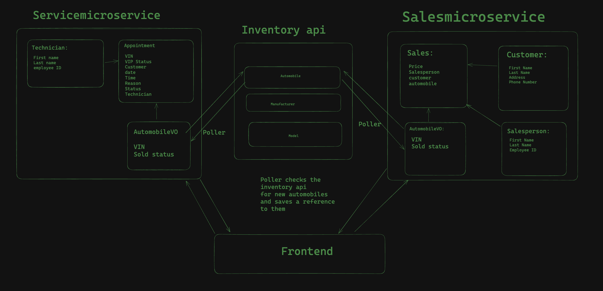

# CarCar

Team:

- Oscar Gamez - Which microservice?
- Brandon Moghadam - Service.

# Instructions To Run

- clone our repository.
- from the root directory, run these commands, one after another:
  "docker volume create beta-data"
  "docker-compose build"
  "docker-compose up"

- Go to localhost:3000 to see our React Front-End.

## Design

## Service microservice

- poller.py
  ability to pull updates from the database that can then be used in my microservice
- models.py
  automobileVO - vin and sold status (ability to pull from the poller)
  technician - first_name, last_name, and employee_id
  appoointments - vin, vip, customer, date, time, reason, status, and technician
- views.py
  "GET "POST" and "PUT" methods to interact with the front end
  created encoders for Automobile VO, technician, and appointments
- urls.py
  connects to the main url which then sets links to localhost3000/api/(specific name in urls.py file by path)
- techlist.js
  shows a list of all technicians in the database
- techcreate.js
  ability to create a technician in the database with the given form specs
- serviceform.js
  ability to create a service appointment in the database with the given specs
- servicehistory.js
  shows a list of all previous service appointments, includes a search bar at the top which searches based on vin numbers
- servicelist.js
  shows a list of all appointments in the database with the ability to click on "cancel" or "finished" to send it to the servicehistory.js
  - List tech GET and POST
    http://localhost:8080/api/technicians/

-List appointments GET and POST
http://localhost:8080/api/appointments/

-List manufacturers GET and POST
http://localhost:8100/api/manufacturers/

## Sales microservice

Explain your models and integration with the inventory
microservice, here.
-poller.py
polls the inventory-api for new automobiles and stores a reference to them inside a AutomobileVO in models
-models.py
AutomobileVO: vin, sold
Salesperson: first_name, Last_name, employee_id
Customer: first_name, last_name, address, phone_number
Sale: automobile foreignkey, salesperson foreignkey, customer foreign key, price
-views.py
list and details views for the follow: salesperson, customer, and sale
-urls.py

- List sales GET and POST
  http://localhost:8090/api/sales/

-List Customers GET and POST
http://localhost:8090/api/customers/

-List salespeople GET and POST
http://localhost:8090/api/salespeople/

-AutomobilesList.js
Displays a list of automobiles from the inventory API

-AutomobileCreate.js
A form that allows a user to add a Automobile to the inventory API

-SalesList.js
Displays list of sales from the sales API

-SalesCreate.js
A form that allows a user to Create a sale, add it to the Sales API, and marks a Automobile as sold in the inventory api.

-CustomerList.js
Displays a list of customers from the Sales API

-CustomerCreate.js
A form that allows a user to create a customer and add it to the sales API

-SalesPeopleList.js
Displays a list of salespeople from the sales API

-SalesPersonCreate.js
A form that allows a user to create and new sales person and add them to the sales API

-SalesPersonHistory.js
Displays all sales from a specified salesperson. there is a dropdown menu at the top that allows a user
to select which salesperson they'd like to see the sales history of.
